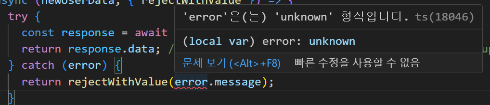

# 시행착오

1. ts, try/catch 문 작성시 catch의 error 타입설정
   
   reason: error의 타입을 unknown을 기본값으로 갖기 때문에 발생

   clear: error를 stringify 하여 리턴하는 함수를 사용

   ```typescript
   function getErrorMessage(error: unknown) {
     if (error instanceof Error) return error.message;
     return String(error);
   }
   ```

   reference:https://immigration9.github.io/typescript/2022/01/09/error-typescript.html
